# Assignment 1

## by Adil Akhmetov

### Quesion 1.

- a.
  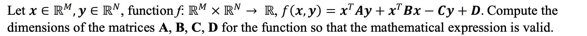

$$
x \in R^M,\ then\ R^{M\times 1} \\
y \in R^N,\ then\ R^{N\times 1} \\
f(x,y) = x^TAy + x^TBx - Cy + D = \\
(R^M)^TA(R^N) + (R^M)^TB(R^M) - C(R^N) + D = \\
R^{1 \times M}AR^N + R^{1 \times M}BR^M - CR^N + D = \\
R^{1 \times M}R^{M \times N}R^N + R^{1 \times M}R^{M \times M}R^M - R^{1 \times N}R^N + R^{1 \times 1} = \\
R + R - R + R = 2R \\
Thus, \\
A \in R^{M\times N},\ B \in R^{M\times M},\ C \in R^{N\times 1},\ D \in R^{1\times 1} \\
$$

- b.
  

$$
f(x) = \sum^N_{i=1} \sum^N_{j=1} x_i x_j M_{ij} = \\
\sum^N_{i=1} ( \sum^N_{j=1} x_j M_{ij} ) x_i = \\
\sum^N_{i=1} x^T M_i x_i = \\
x^T \sum^N_{i=1} M_i x_i = \\
x^T M x = \\
R^{1 \times N}R^{N \times M}R^{N \times 1} = R
$$

P.S. I hope, that I was correct in the notation. The result must be scalar, so the eventual result must be correct, but I am not sure about the approach.

- c.
  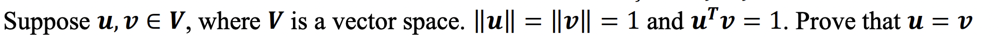

Let's use the following formula:

$$
\theta = \cos^{-1}\frac{u^Tv}{|u||v|}
$$

Then,

$$
\theta = \cos^{-1}\frac{1}{1*1} = cos^{-1}(1) = 0
$$

So, the angle between the vectors is 0. It means, that the vectors are directed to the one side. And since the lengths of the vectors are equal, the vectors are the same.

## Quesion 2.

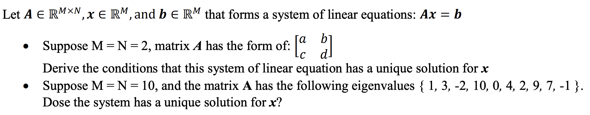

- So, I think, that if the determinant of the matrix is 0, then the matrix is singular. And if the matrix is singular, then the matrix is not invertible. Thus, it has a linear dependency in it. Hence, that this system of linear equation has no solution. The main condition is:
  $$
  \det(A) \neq 0 \\
  ad - bc \neq 0
  $$
- The set of eigenvalues contains 0, which means that the kernel (nullspace) of the matrix is nonzero. This means that the matrix has determinant equal to zero. Then, according to the solution above, the matrix is singular and not invertible. Hence, that this system of linear equation has no solution.

## Quesion 3.

- a.
  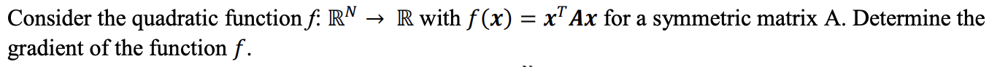

$$
f(x) = \sum^n_{i=1} \sum^n_{j=1} A_{ij} x_i x_j \\
\frac{\delta{f(x)}}{\delta{x_k}} = \frac{\delta}{\delta{x_k}}\sum^n_{i=1} \sum^n_{j=1} A_{ij} x_i x_j = \\
\frac{\delta}{\delta{x_k}} [
\sum_{i \neq k} \sum_{j \neq k} A_{ij} x_i x_j +
\sum_{i \neq k} A_{ik} x_i x_k + \sum_{j \neq k} A_{kj} x_k x_j
+ A_{kk} x^2_k
] = \\
\sum_{i \neq k} A_{ik} x_i + \sum_{j \neq k} A_{kj} x_j + 2A_{kk} x_k = \\
\sum^n_{i=1} A_{ik} x_i + \sum^n_{j=1} A_{kj} = 2 \sum^n_{i=1} A_{ki} x_i \\
\frac{\delta^2{f(x)}}{\delta{x_k}\delta{x_l}} = 2A_{lk} = 2A_{kl} \\
\triangledown^2_x{f(x)} = 2A
$$

P.S. Taken from lecture 2 slide 67.

## Question 4.

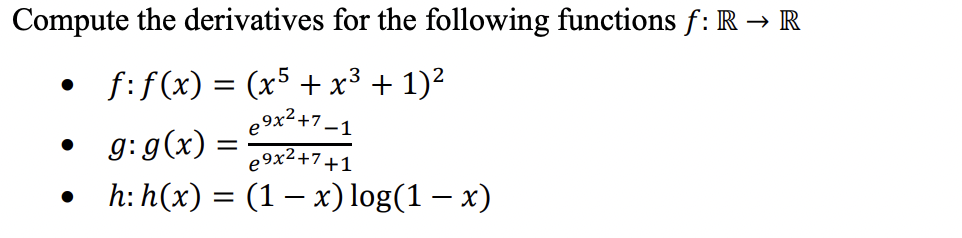

- $$
  f'(x) = ((x^5 + x^3 + 1)^2)' = \\
  2(x^5 + x^3 + 1)^{2-1} \times (x^5 + x^3 + 1)' = \\
  2(x^5 + x^3 + 1) \times (5x^4 + 3x^2 + 0) = \\
  10 x^9 + 16 x^7 + 6 x^5 + 10 x^4 + 6 x^2
  $$

- $$
  g'(x) = (\frac{e^{9x^2+7}-1}{e^{9x^2+7}+1})' = \\
  \frac{(e^{9x^2+7}-1)'(e^{9x^2+7}+1) - (e^{9x^2+7}-1)(e^{9x^2+7}+1)'}{(e^{9x^2+7}+1)^2} = \\
  \frac{((e^{9x^2+7})'-0)(e^{9x^2+7}+1) - (e^{9x^2+7}-1)((e^{9x^2+7})'+0)}{(e^{9x^2+7}+1)^2} = \\
  \frac{(e^{9x^2+7}(9x^2+7)'-0)(e^{9x^2+7}+1) - (e^{9x^2+7}-1)(e^{9x^2+7}(9x^2+7)'+0)}{(e^{9x^2+7}+1)^2} = \\
  \frac{(e^{9x^2+7}(18x+0)-0)(e^{9x^2+7}+1) - (e^{9x^2+7}-1)(e^{9x^2+7}(18x+0)+0)}{(e^{9x^2+7}+1)^2} = \\
  \frac{(e^{9x^2+7}(18x+0)-0)(e^{9x^2+7}+1) - (e^{9x^2+7}-1)(e^{9x^2+7}(18x+0)+0)}{(e^{9x^2+7}+1)^2} = \\
  \frac{18xe^{9x^2+7}(e^{9x^2+7}+1) - 18xe^{9x^2+7}(e^{9x^2+7}-1)}{(e^{9x^2+7}+1)^2} = \\
  \frac{36xe^{9x^2+7}}{(e^{9x^2+7}+1)^2}
  $$

- $$
  h'(x) = ((1-x)log(1-x))' = \\
  (1-x)'log(1-x) + (log(1-x))'(1-x) = \\
  (0 - 1)log(1-x) + \frac{(1-x)'}{1-x}(1-x) = \\
  - log(1-x) + (0 - 1) = \\
  - log(1-x) - 1
  $$

## Question 5.

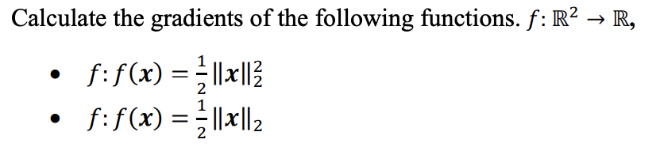

- $$
  f(x) = \frac{1}{2}||x||^2_2 = \frac{1}{2}
  \left (
  \sum^n_{i=1} |x_i|^2
  \right) \\

  f'(x) = \frac{\delta{f(x)}}{\delta{x_k}} = \frac{1}{2} \frac{\delta}{\delta{x_k}}
  \left [
  \sum^n_{i \neq k} |x_i|^2 + |x_k|^2
  \right] = \\
  \frac{1}{2}
  \left [
  0 + 2|x_k|^{2-1}
  \right ] = |x_k|
  $$

- $$
  f(x) = \frac{1}{2}||x||_2 = \frac{1}{2}
  \left (
  \sum^n_{i=1} |x_i|^2
  \right)^{\frac{1}{2}} \\

  f'(x) = \frac{\delta{f(x)}}{\delta{x_k}} = \frac{1}{2} \frac{\delta}{\delta{x_k}}
  \left [
  \left (
  		\sum^n_{i \neq k} |x_i|^2 + |x_k|^2
  \right )^{\frac{1}{2}}
  \right] = \\
  \frac{1}{2}
  \left [
  \frac{1}{2} \left (
  		0 + 2|x_k|^{2-1}
  	  \right )^{\frac{1}{2}-1}
  \right ] = \frac{1}{4\sqrt{2|x_k|}}
  $$

P.S. I'm not sure this is correct, I couldn't figure out how to properly calculate the gradient, so I used the solution from Question 3 as an example

## Question 6.

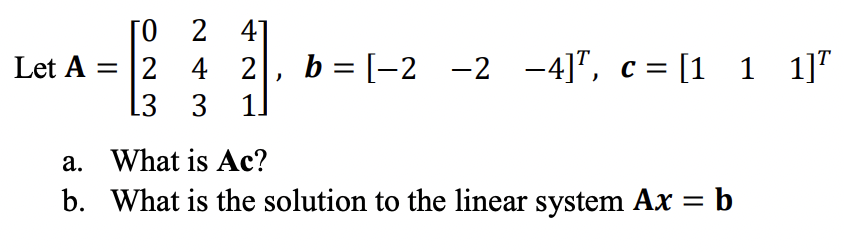

- a.

  $$
  Ac = \begin{bmatrix}
  0 & 2 & 4 \\
  2 & 4 & 2 \\
  3 & 3 & 1
  \end{bmatrix}
  \begin{bmatrix}
  1 & 1 & 1
  \end{bmatrix}^T = \\
  \begin{bmatrix}
  0 * 1 + 2 * 1 + 4 * 1 \\
  2 * 1 + 4 * 1 + 2 * 1 \\
  3 * 1 + 3 * 1 + 1 * 1
  \end{bmatrix} = \\
  \begin{bmatrix}
  0 + 2 + 4 \\
  2 + 4 + 2 \\
  3 + 3 + 1
  \end{bmatrix} =
  \begin{bmatrix}
  6 \\
  8 \\
  7
  \end{bmatrix}
  $$

- c.

$$
Ax = b \\
x = A^{-1}b \\
det(A) = \begin{bmatrix}
  0 & 2 & 4 \\
  2 & 4 & 2 \\
  3 & 3 & 1
  \end{bmatrix} = \\
  - \begin{bmatrix}
  2 & 4 & 2 \\
  0 & 2 & 4 \\
  3 & 3 & 1
  \end{bmatrix} = \\
  - \begin{bmatrix}
  2 & 4 & 2 \\
  0 & 2 & 4 \\
  0 & -3 & -2
  \end{bmatrix} = \\
  - \begin{bmatrix}
  2 & 4 & 2 \\
  0 & 2 & 4 \\
  0 & 0 & 4
  \end{bmatrix} = \\
  - (2*2*4) = -16\\

det(A) \neq 0 \\
Then, \\

A^{-1} =
\begin{bmatrix}
  \frac{1}{8} & -\frac{5}{8} & \frac{3}{4} \\
  -\frac{1}{4} & \frac{3}{4} & -\frac{1}{2} \\
  \frac{3}{8} & -\frac{3}{8} & \frac{1}{4}
  \end{bmatrix} \\

x = \begin{bmatrix}
  \frac{1}{8} & -\frac{5}{8} & \frac{3}{4} \\
  -\frac{1}{4} & \frac{3}{4} & -\frac{1}{2} \\
  \frac{3}{8} & -\frac{3}{8} & \frac{1}{4}
  \end{bmatrix} \times \begin{bmatrix}
  -2 \\
  -2 \\
  -4 \\
  \end{bmatrix} = \begin{bmatrix}
  -2 \\
  1 \\
  -1
  \end{bmatrix}
$$

## Question 7.

- a. 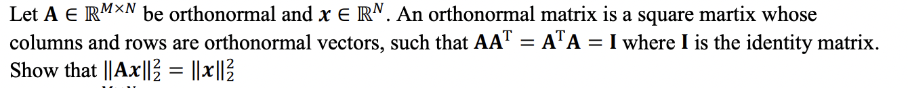

First, I want to note and if $M \neq N$, then $AA^T \neq I$ according to the lecture notes. But, maybe I'm wrong

$$
||Ax||^2_2 = (Ax)^TAx=A^Tx^TAx=A^TAx^Tx=Ix^Tx=x^Tx=||x||^2_2
$$

- b. 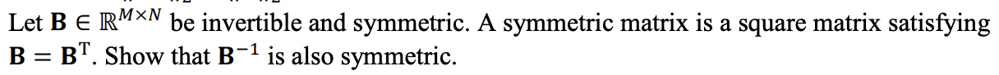

Same here, I'm not sure that if $M \neq N$ A matrix may be symmetric.

$$
Since,\ I=I^T\ and\ AA^{-1}=I \\
AA^{-1}=(AA^{-1})^T \\
AA^{-1}=(A^{-1})^TA^T \\
AA^{-1}=(A^{-1})^TA \\
A^{-1}AA^{-1}=(A^{-1})^TAA^{-1} \\
A^{-1}I=(A^{-1})^TI \\
A^{-1}=(A^{-1})^T \\
$$

- c. 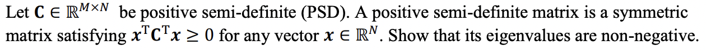
  I guess, there is a typo in the condition of PSD. It must've been $x^TCx\geq{0}$

$$
Ax = \lambda{x} \\
Suppose\\
x = \vec{v}\ (an\ eigenvector) \\
Then,\\
A\vec{v} = \lambda{\vec{v}} \\
\vec{v}^TA\vec{v} \geq 0 \\
\vec{v}^T\lambda\vec{v} \geq 0
$$

P.S. I didn't figure out how to prove it, maybe if eigenvectors are nonnegative, then $\lambda$ must be nonnegative as well?

## Question 8.

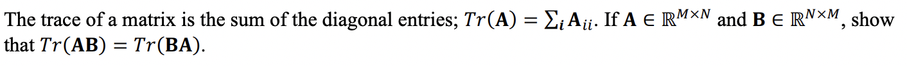

$$
Tr(AB) = \sum^m_{i=1}(AB)_{ii} =
\sum^m_{i=1}(\sum^n_{j=1}A_{ij}B_{ji}) =
\sum^m_{i=1}\sum^n_{j=1}A_{ij}B_{ji} =
\sum^n_{j=1}\sum^m_{i=1}B_{ji}A_{ij} =
\sum^n_{j=1}(\sum^m_{i=1}B_{ji}A_{ij}) =
\sum^n_{j=1}(BA)_{jj} = Tr(BA)
$$

P.S. taken from the lecture notes page 9

## Question 9.

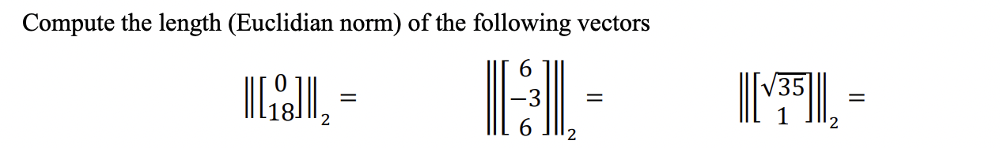

- $$
  \left| \left|
  \begin{bmatrix}
  0 \\
  18
  \end{bmatrix}
  \right| \right|_2 =
  (|0|^2 + |18|^2)^{\frac{1}{2}} = 18
  $$

- $$
  \left| \left|
  \begin{bmatrix}
  6 \\
  -3 \\
  6
  \end{bmatrix}
  \right| \right|_2 =
  (|6|^2 + |-3|^2 + |6|^2)^{\frac{1}{2}} = 9
  $$

- $$
  \left| \left|
  \begin{bmatrix}
  \sqrt{35} \\
  1
  \end{bmatrix}
  \right| \right|_2 =
  (|\sqrt{35}|^2 + |1|^2)^{\frac{1}{2}} = 6
  $$

## Question 10.

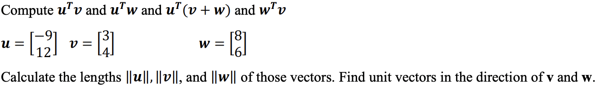

$$
u^Tv = \begin{bmatrix}
  -9 & 12
  \end{bmatrix} \begin{bmatrix}
  3 \\
  4
  \end{bmatrix} = -9*3 + 12*4 = 21 \\

u^Tw = \begin{bmatrix}
  -9 & 12
  \end{bmatrix} \begin{bmatrix}
  8 \\
  6
  \end{bmatrix} = -9*8 + 12*6 = 0 \\

w^Tv = \begin{bmatrix}
  8 & 6
  \end{bmatrix} \begin{bmatrix}
  3 \\
  4
  \end{bmatrix} = 8*3 + 6*4 = 48 \\

||u|| = \sqrt{(-9)^2 + (12)^2} = \sqrt{225} = 15 \\
||v|| = \sqrt{3^2 + 4^2} = 5 \\
||w|| = \sqrt{8^2 + 6^2} = 10 \\

\vec{v} = \frac{1}{5} \begin{bmatrix}
  3 \\
  4
  \end{bmatrix} = \begin{bmatrix}
  \frac{3}{5} \\
  \frac{4}{5}
  \end{bmatrix} \\

\vec{w} = \frac{1}{10} \begin{bmatrix}
  8 \\
  6
  \end{bmatrix} = \begin{bmatrix}
  \frac{8}{10} \\
  \frac{6}{10}
  \end{bmatrix} \\
$$

## Question 11.

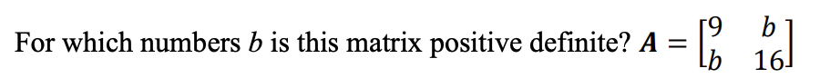
I'll use determinants test, so that $1>0$ and $det(A)>0$

$$
det(A) > 0 \\
9*16-b*b > 0 \\
144-b^2 > 0 \\
144 > b^2 \\
b^2 < 144 \\
b < \sqrt{144} \\
b < 12 \\
b > - 12 \\

b \in (-12, 12)
$$

## Question 12.

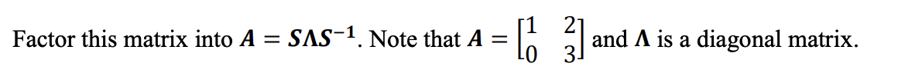

1. Find eigenvalues of A

   $$
   A - \lambda I = \begin{bmatrix}
   1 & 2 \\
   0 & 3
   \end{bmatrix} - \begin{bmatrix}
   \lambda & 0 \\
   0 & \lambda
   \end{bmatrix} = \begin{bmatrix}
   1 - \lambda & 2 \\
   0 & 3 - \lambda
   \end{bmatrix} \\

   det \left ( \begin{bmatrix}
   1 - \lambda & 2 \\
   0 & 3 - \lambda
   \end{bmatrix} \right ) = 0 \\
   (1-\lambda)(3-\lambda) - 0 *2 = 0 \\
   \lambda = 1,\ \lambda = 3
   $$

2. Find an eigenvector associated with each eigenvalue of A

   $$
   Eigenvector for \lambda = 1 \\

         A - \lambda I = \begin{bmatrix}
   1 - 1 & 2 \\
   0 & 3 - 1
   \end{bmatrix} = \begin{bmatrix}
   0 & 2 \\
   0 & 2
   \end{bmatrix} \\

         By\ echelon\ method \\
   \begin{bmatrix}
   1 \\
   0
   \end{bmatrix} for \lambda = 1 \\
   $$

   $$
   Eigenvector for \lambda = 3 \\

      	A - \lambda I = \begin{bmatrix}
   1 - 3 & 2 \\
   0 & 3 - 3
   \end{bmatrix} = \begin{bmatrix}
   -2 & 2 \\
   0 & 0
   \end{bmatrix} \\

   	By\ echelon\ method \\
   	\begin{bmatrix}
   	1 \\
   	1
   	\end{bmatrix} for \lambda = 3 \\
   $$

3. Construct matrices S and $\Lambda$ so that $\Lambda$ is diagonal.

$$
S = \begin{bmatrix}
  1 & 1 \\
  0 & 1
  \end{bmatrix} \\

  \Lambda = \begin{bmatrix}
  1 & 0 \\
  0 & 3
  \end{bmatrix} \\

  S^{-1} = \begin{bmatrix}
  1 & -1 \\
  0 & 1
  \end{bmatrix} \\
$$
