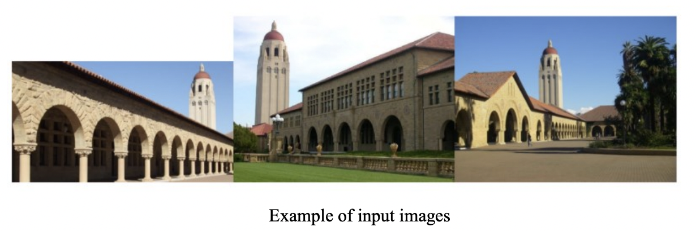

# Assignment 3

## by Adil Akhmetov

### Question 1

Suppose you have a large collection of photos from your trips, including photos of yourself alone,
photos of yourself with other people, photos of other people without you, as well as photos without
people. Suppose you also have a template of your face, which consists of a small image of your
face together with the 2D coordinates for the center of your eyes, tip of your nose, and ears.
Describe a fully automatic algorithm that uses what you have learned in class to find the subset of
the images that contains unoccluded frontal faces of you as well as the location, orientation and
scale of a bounding box containing your face.

### Solution

My approach is a bit naive and simple. Since I already have a template of my face with defined 2D coordinates of face feature wrt bounding box coordinates, I'd say that object model specification part is ready. When generating hypothesis, I will apply the template of my face at different locations, scales and orientations by sliding window approach. Then, each window is going to be separately classified. After that, I will compute a maching score. It may need the use of upsampling and interpolation methods on the template and convolution with the image. After sorting the matching scores, I will take the matches with the highest score and apply non-maximum suppression to get the final result. Now, in order to omit the images that contain no face or faces of other people, we need to identify a threshold which can say that the image contains a face of me. This threshold can be computed by taking the average of the matching scores of the images that contain my face. Then, we can say that the images with matching score higher than the threshold contain my face. Of course, my approach is not perfect and might be inaccurate, but it can be improved by using more sophisticated methods such as Haar-like features, HOG, etc.

### Question 2

Given a dataset that consists of images of the Hoover tower, your task is to learn a classifier to
detect the Hoover tower in new images. You implement PCA to reduce the dimensionality of your
data, but find that your performance in detecting the Hoover tower significantly drops in
comparison to your method on the original input data. A sample of your input training images are
given in Fig. 1. Why is the performance suffering?

### Solution

The Hoover tower in the input images is not aligned around the basis, which means that the basis is not orthogonal to the Hoover tower. This is why the performance is suffering. In order to improve the performance, we need to find a new basis that is orthogonal to the Hoover tower. This can be done by using SVD. The SVD of the input data matrix will give us the basis that is orthogonal to the Hoover tower. Then, we can use this basis to project the input data onto a lower dimensional space. This will improve the performance.

### Question 3

You are using k-means clustering in color space to segment an image. However, you notice that although pixels of similar color are indeed clustered together into the same clusters, there are many discontiguous regions because these pixels are often not directly next to each other. Describe a method to overcome this problem in the k-means framework.

### Solution

Add the coordinates of pixels with the colors as an input, so that k-means algorithm will consider them (coordinates) as well in the computation.

### Question 4

Given a dataset that consists of following points:  
$$
x_1 = (−1,1), 𝑥_2 = (1,1), 𝑥_3 = (−1, −1), 𝑥_4 = (1, −1)
$$
We want to do K-means clustering using Euclidean distances when $K = 2$. We start by randomly
picking two points as the cluster centroids.

- a) What are all possible clustering results?
- b) Among all possible clustering results, which have the smallest cost, as measured in total distance (defined as follows)?  
We are given points $x_1, … , x_4 \in R_n$
and we wish to organize these points into 2 clusters. This
amounts to choosing labels $l_1, … , l_4$ for each points, where each $l_i \in {1,2}$. The total distance is defined as
$$
\sum_{i=1}^4 d(x_i, \mu_{l_i})
$$
Where $\mu_c$ is the center of all points $x_i$ with $l_i = c$ and $d(x,y)$ is the Euclidean distance between the points $x$ and $y$.
- c) In a situation like above, how could you modify the K-means algorithm to output a clustering result that has relatively small total distances?

### Solution

- a)
  - Cluster 1: $x_1$; Cluster 2: $x_2, x_3, x_4$
  - Cluster 1: $x_1, x_2$; Cluster 2: $x_3, x_4$
  - Cluster 1: $x_1, x_3$; Cluster 2: $x_2, x_4$
  - Cluster 1: $x_1, x_2, x_3$; Cluster 2: $x_4$
  - Cluster 1: $x_1, x_2, x_4$; Cluster 2: $x_3$
  - Cluster 1: $x_1, x_3, x_4$; Cluster 2: $x_2$
- b)
  - Cluster 1: $x_1, x_2$; Cluster 2: $x_3, x_4$; total distance = 4
  - Cluster 1: $x_1, x_3$; Cluster 2: $x_2, x_4$; total distance = 4
  - Cluster 1: $x_1$; Cluster 2: $x_2, x_3, x_4$; total distance = 3.86 ($\sqrt(10) + \sqrt(0.5)$)
  - Cluster 1: $x_1, x_2, x_3$; Cluster 2: $x_4$; total distance = 3.86
  - Cluster 1: $x_1, x_2, x_4$; Cluster 2: $x_3$; total distance = 3.86
  - Cluster 1: $x_1, x_3, x_4$; Cluster 2: $x_2$; total distance = 3.86  
So, the last four have the smallest cost.
- c) Just iterate several times with randomized initial points until the cost is minimized.

### Question 5

Implementations of the K-Means algorithm will often have the parameter _num_iters_ to define the
maximum number of iterations the algorithm should run for. Consider that we opt to not include
this upper bound on the number of iterations, and that we define the termination criterion of the
algorithm to be when the cost L stops changing.  
Recall that $L$ is defined as the sum of squared distance between all points $x$ and their nearest cluster center $c$:
$$
L = \sum_{i\ \in\ clusters} \sum_{x\ \in\ cluster_i} ||x - c_i||^2
$$
Show that for any set of points $D$ and any number of clusters $k$, the K-Means algorithm will
terminate in a finite number of iterations.

### Solution

I might be wrong, but I guess that we have a finite number of possible iterations defined by $C^D_K$ (the number of ways to choose $K$ elements, i.e., initial points from a set of $D$ elements), thus the algorithm will terminate in a finite number of iterations. Isn't it sufficient to iterate through all possible initial points?

### Question 6

Image segmentation with Normalized-Cut

- a. Define an affinity measure, A(i,j), which measures the similarity of pixels i and j and
depends on the similarity of their intensities, f(i) and f(j), and inversely on their distance
apart, d(i,j). Briefly explain the rationale for your definition.
- b. To minimize the computational burden of NCut, which requires computing a very large
affinity matrix, suppose we first divide an input image into small sub-images, say each of
size 50×50. Using these sub-images, describe the main steps of a procedure to use NCut in a two-stage fashion (first with the sub-images, and second with the results of the first stage) to segment an image.

### Solution

- a)  
  $$
  A(i,j) = e^{-\frac{||f(i)-f(j)||}{\sigma_1^2}} \cdot \begin{cases}
    e^{-\frac{d(i,j)}{\sigma_2^2}} & \text{if } d(i,j) \lt T \\
    0 & \text{otherwise}
  \end{cases}
  $$
  where $\sigma_1$ and $\sigma_2$ are the standard deviations of the two measures, and $T$ is the threshold for the distance between pixels, this way affinity between faraway pixels in the image is always 0. 
- b)
  1. Divide the image into sub-images.
  2. Compute the affinity matrix for each sub-image.
  3. Compute the normalized cut for each sub-image.
  4. Combine the results of the normalized cut for each sub-image by merging the sub-images results from previous step.
  5. Define a new graph with the sub-images as nodes and the edges between them as the affinity between the sub-images.
  6. Define a new affinity function for the new graph, considering the size, brightness, or other features. In case two regions are not connected, the affinity between them is 0. Elsewhere, it depends on the size of the regions, the brightness, or other features.
  7. Use NCut on a new graph with the sub-images as nodes and the edges between them as the affinity between the sub-images.